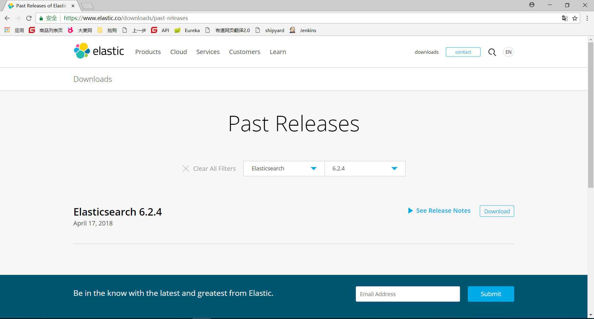

# Elasticsearch
## 介绍
谈到Elasticsearch就必须首先谈Lucene。Lucene采用Java语言开发，被认为是迄今为止最先进、性能最好的、功能最全的搜索引擎库。但是，Lucene只是一个库。想要使用它，你必须使用Java来作为开发语言并将其集成到需要搜索功能的应用中。由于Lucene自身的专业性和复杂性，开发者在接入Lucene前，必须要深入了解检索的相关知识，这就给基于Lucene搜索引擎的开发工作带来了一定的难度。

Elasticsearch也使用Java开发并使用Lucene作为其核心来实现所有索引和搜索的功能，但是它通过简单的RESTful API来隐藏Lucene的复杂性，从而让全文搜索变得简单。不过，Elasticsearch不仅仅是Lucene和全文搜索，我们还可以从这样几个维度去描述它：

- 分布式实时全文搜索引擎：Elasticsearch以Document的形式对数据记录进行存储，并且对每一个字段均可以检索。

- 分布式实时分析搜索引擎：Elasticsearch 有一个功能叫聚合（aggregations），允许我们基于数据生成一些精细的分析结果。聚合与 SQL 中的 GROUP BY 类似但更强大。

- 分布式实时大数据处理引擎：Elasticsearch可以扩展到上百台服务器，处理PB级结构化或非结构化数据。

开发者可以通过简单的RESTful API、各种语言的客户端甚至命令行与之交互,完成上述功能。

## 安装
安装过程选用CentOS7做为操作系统，选用的Elasticsearch版本为 6.2.4,具体安装步骤如下。

1. 访问Elasticsearch官网下载Elasticsearch安装文件。如图-1、图-2所示，下载的文件如图-3所示。



2. 下载elasticsearch对应的IK分词器：访问elasticsearch-analysis-i1. 1. k软件GitHub托管地址https://github.com/medcl/elasticsearch-analysis-ik 如图-4、图-5所示。点击“Download ZIP”下载elasticsearch-analysis-ik压缩包。


3. 上传elasticsearch及elasticsearch-analysis-ik软件包到Linux服务器.

4. 使用以下命令<a name="_Hlk518379760">将elasticsearch-6.2.4</a>.tar.gz解压至/usr/local/目录.
```shell
tar -zxvf elasticsearch-6.2.4.tar.gz
```
1. 将elasticsearch-6.2.4更名为elasticsearch。
```shell
mv elasticsearch-6.2.4 elasticsearch
```
1. 使用以下命令切换至elasticsearch/config目录，切换后的目录如图-10所示 。
```shell
cd /elasticsearch/config/
```


1. 修改elasticsearch.yml文件为以下内容。
```shell
#集群名称
cluster.name: elasticsearch-application 
#集群端口
http.port: 9200
#节点ip 
network.host: 0.0.0.0
```
1. 解压elasticsearch-analysis-ik-6.2.4.zip到“/usr/local/ik”目录，如图11所示。


1. 在“/usr/local/elasticsearch/plugins”目录下创建“analysis-ik”目录，如图-12.


1. 使用以下命令将解压后的“ik”插件包的文件拷贝至“/usr/local/elasticsearch/plugins/analysis-ik”目录
```shell
cp -r /usr/local/ik/elasticsearch/*  /usr/local/elasticsearch/plugins/analysis-ik/
```
拷贝后的“analysis-ik”目录下的文件如图-13所示.


1. elasticsearch不能使用root用户进行启动，因此需要创建对应管理elasticsearch的用户。使用以下命令创建elsearch用户组，并在“elsearch”组下创建名为“elsearch”用户，设置密码为“elasticsearch”。
```shell
groupadd elsearch
useradd elsearch -g elsearch -p elasticsearch
```
1. 为“elsearch”用户创建elasticsearch目录的读写及执行权限，如图-14所示


1. 切换至elsearch用户，并启动elasticsearch，启动命令如图-15所示
```shell
elasticsearch/bin/elasticsearch -d
```


1. 按照以下路径访问elasticsearch，访问界面如图-16所示。如能出现图16所示则表示elasticsearch安装成功。
```shell
http://ip地址:9200/
```


